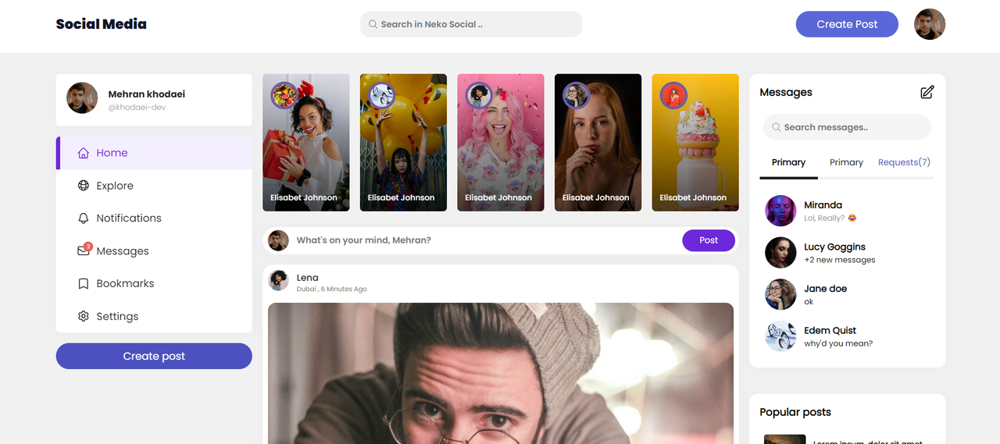
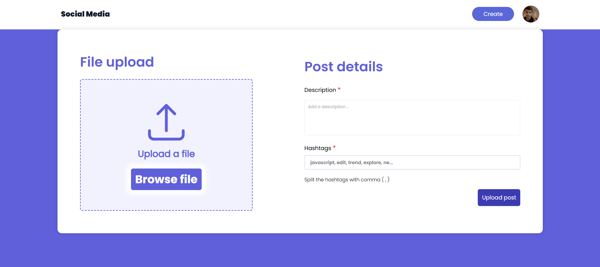

# Social Media v1.00

### This social media project, similar to Instagram, has been developed using the MVC architecture. Key features include user account creation, adding posts, editing profile information, liking posts, and following other users.

**Note:** This is an early version of the project and is not yet complete.  
New features are currently being developed and added.

## Development tools

## Project views

 

  
### Home Page ✌️❤️

**Developing**
 
 

### Personal Page ✌️❤️

### Upload Post ✌️❤️

## Features

- Clean and modern design
- With the ability to create a Personal page
- Follow and unfollow
- Like and dislike posts
- With the ability to save posts in bookmark
- As well as Account recovery and password change in case of forgetting it

## Installation

To get started, follow these steps:

**Make sure MongoDB is running on your system**

1. Clone the repository: `git clone https://github.com/khodaeidev/social-media.git`
2. Navigate to the project folder: `cd social-media`
3. Install dependencies: `npm install`
4. Run the development server: `npm run dev`
5. Open your browser and visit [http://localhost:4002](http://localhost:4002)

---

<h3>Feel free to use this template for your own portfolio and showcase your work! If you encounter any issues or have suggestions for improvement, please open an issue or submit a pull request. Happy coding! 😀❤️ </h3>

---

  <h2> Developed By ❤️ With Mehran Khodaei </h2>

